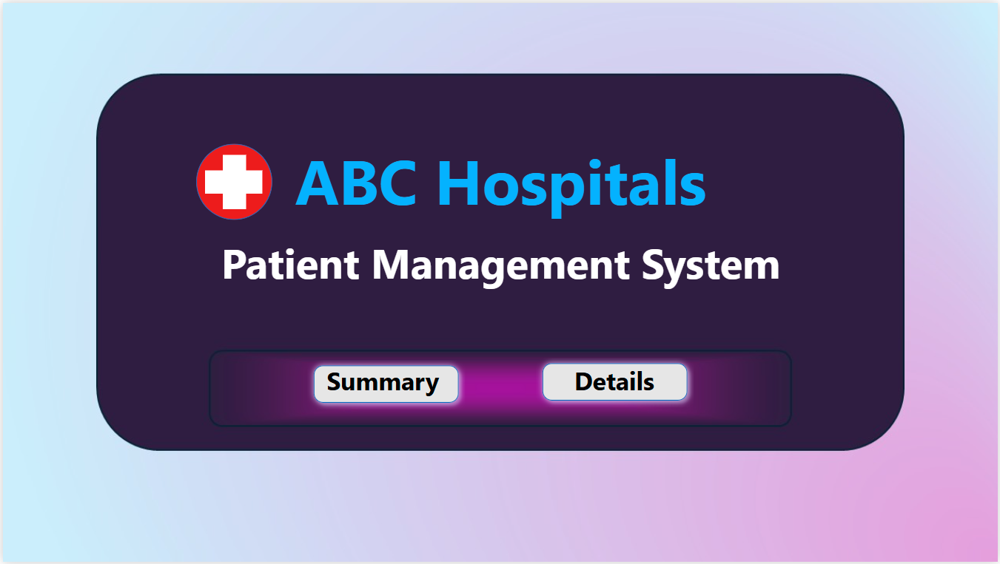
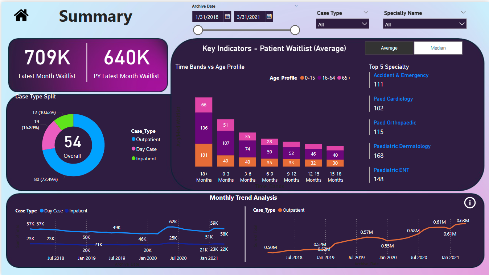
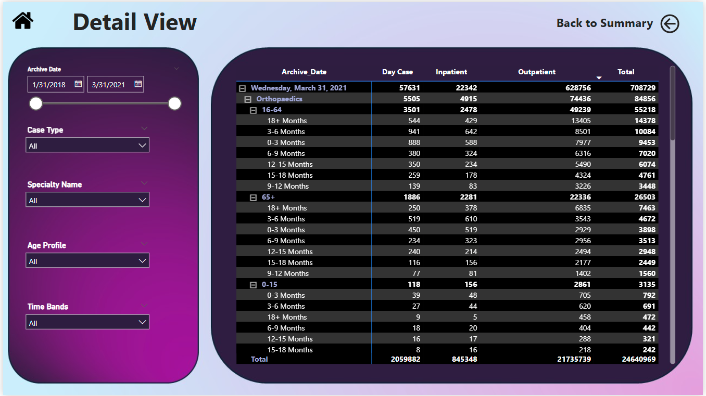

# Patient Management System - Power BI Dashboard

This repository contains an interactive **Patient Management System Dashboard** built in Power BI to help hospital administrators track, monitor, and analyze key patient metrics across multiple specialties and case types.

*****************************************************************

## Project Overview

The dashboard visualizes:
- Patient waitlists across multiple months and years  
- Case type splits (Outpatient, Day Case, Inpatient)  
- Top specialties by patient volume  
- Monthly trends and patterns  
- Drill-down details for age profiles, time bands, and specialties

*****************************************************************

## Key Features

- **Interactive Navigation:** Main Page where we can navigate to Summary and Detailed views Pages with custom buttons
- **Dynamic Filters:** Filter by archive date, case type, specialty, age profile, and time bands
- **Clear KPIs:** Highlight latest month waitlists vs. previous year
- **Visual Highlights:** Bar charts, donut charts, trend lines, and tables for actionable insights
- **Modern Design:** Gradient backgrounds, dark theme panels, clean layouts

*****************************************************************

## Files Included

- `PatientManagementSystem.pbix`- Main Power BI file
- `/screenshots`- Key screenshots of the dashboard (Main Page, Summary, Detail)
- `/data`- (Optional) Sample dataset (if available)
- `README.md` - Project description

*****************************************************************

## How to Use

1. Download or clone the repository  
2. Open the `.pbix` file in **Power BI Desktop**  
3. Load, Transform and Process the data   
4. Explore the interactive visuals, filters and navigation

*****************************************************************

## Project Screenshots

### Main Page

### Summary Page

### Detail View Page

*****************************************************************

## Key Insights

- Identified top-performing and bottleneck specialties
- Analyzed patient trends across age profiles and time bands
- Provided hospital leadership with data-driven decision support

*****************************************************************

## Author

👤 **Ranjithnath Karunanidhi**  
[GitHub](https://github.com/Ranjithnathk) | [LinkedIn](https://www.linkedin.com/in/ranjithnathk)

*****************************************************************

